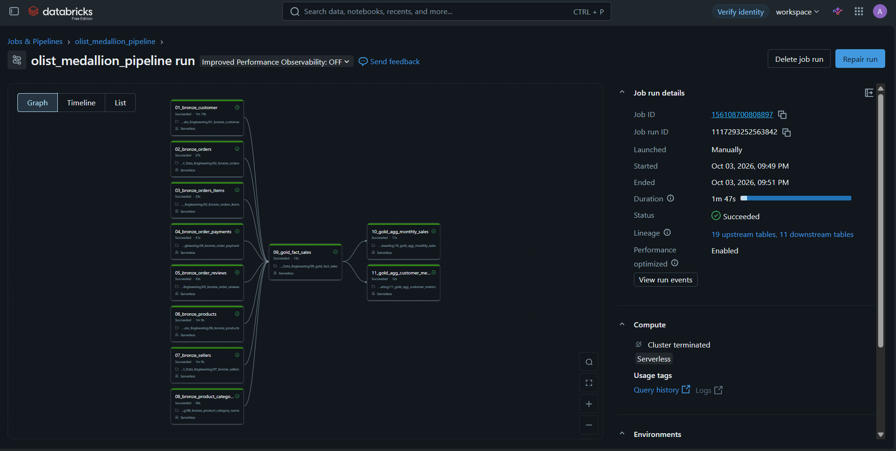
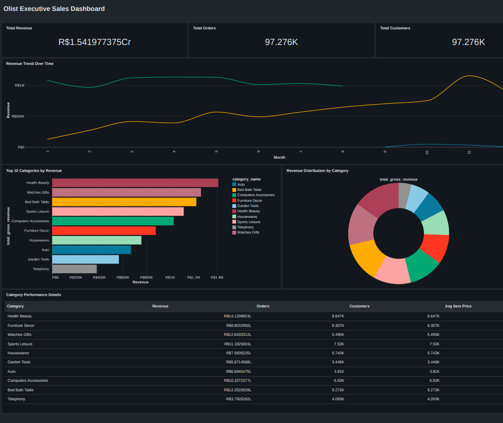

# 🛒 Olist Brazilian E-Commerce: End-to-End Medallion Lakehouse Pipeline

An automated, production-grade data engineering pipeline built on **Databricks**, **Delta Lake**, and **PySpark**, orchestrated using **Databricks Workflows (DAG)** and visualized with an **Executive BI Dashboard**.

---

## 🏗️ Architecture Overview

The pipeline implements the **Medallion Architecture** to progressively structure, clean, and enrich raw e-commerce data:

                                              [ Raw CSV Datasets ]
                                                      │
                                                      ▼
                             ┌────────────────────────────────────────────────────────┐
                             │  BRONZE LAYER (Raw Ingestion & Schema Enforcement)     │
                             │  • Orders, Items, Customers, Payments, Reviews,        │
                             │    Products, Sellers, Categories                       │
                             └────────────────────────────────────────────────────────┘
                                                      │
                                                      ▼ (Data Cleansing, Deduplication, Typing)
                             ┌────────────────────────────────────────────────────────┐
                             │  SILVER LAYER (Conformed & Validated Tables)           │
                             │  • Validated status flags, timestamps, null handling   │
                             └────────────────────────────────────────────────────────┘
                                                      │
                                                      ▼ (Star Schema Modeling & Aggregations)
                             ┌────────────────────────────────────────────────────────┐
                             │  GOLD LAYER (Business-Ready Analytics)                 │
                             │  • fct_sales (Star Schema Fact Table)                  │
                             │  • agg_monthly_sales (YoY Trends & Metrics)            │
                             │  • agg_customer_metrics (Lifetime Value & Order Count) │
                             └────────────────────────────────────────────────────────┘
                                                      │
                                                      ▼
                             ┌────────────────────────────────────────────────────────┐
                             │  BI & ORCHESTRATION                                    │
                             │  • Databricks Workflow Multi-Task DAG (Scheduled Daily)│
                             │  • Databricks Lakeview Executive Sales Dashboard       │
                             └────────────────────────────────────────────────────────┘

---

## 📊 Pipeline Orchestration & Architecture

### 11-Task Workflow DAG (Automated Daily Run)

---

## 📈 Executive Sales BI Dashboard

### Real-Time Analytics & Key Business Metrics

---

## ⚙️ Key Technical Features

- **Distributed Data Processing:** PySpark data transformations running on Serverless compute.
- **ACID Transactions & Delta Lake:** Schema validation, time travel, and optimized Delta storage formats.
- **Automated Workflow Orchestration:** 
  - 11-node Directed Acyclic Graph (DAG) in **Databricks Jobs**.
  - 8 parallel Bronze/Silver ingestion tasks for minimal latency.
  - Dependency triggers for central Gold fact and aggregation marts.
  - Automated daily cron schedule with error monitoring.
- **Dimensional Modeling:** Kimball star-schema design separating transactional sales facts from customer, product, and seller dimensions.
- **Business Intelligence Layer:** Interactive dashboard highlighting Total Revenue, Month-over-Month growth, Year-over-Year sales trends, and top revenue-generating categories.

---

## 📂 Pipeline Stages & Notebooks

| Layer | Notebook | Description |
|---|---|---|
| **Bronze** | `01_bronze_customer` to `08_bronze_product_category_name` | Raw data ingestion into Delta tables with initial schema definition. |
| **Gold Fact** | `09_gold_fact_sales` | Central fact table joining orders, items, products, customers, and sellers. |
| **Gold Mart** | `10_gold_agg_monthly_sales` | Monthly rollups for revenue, order volume, and category metrics. |
| **Gold Mart** | `11_gold_agg_customer_metrics` | Customer lifetime value, order frequency, and retention indicators. |

---

## 🛠️ Tech Stack

- **Platform:** Databricks (Serverless Compute, Unity Catalog)
- **Engine:** Apache Spark / PySpark
- **Storage:** Delta Lake
- **Language:** Python, SQL
- **Orchestration:** Databricks Workflows (DAGs)
- **Analytics & BI:** Databricks Lakeview Dashboards
